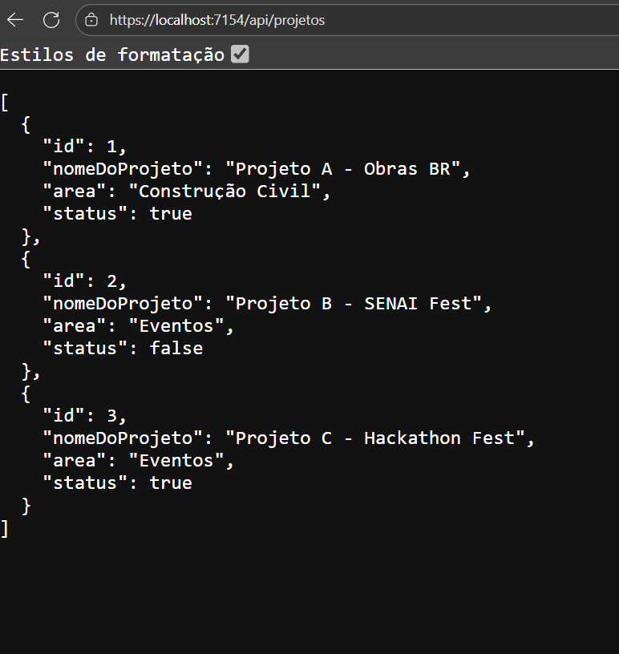

# Projeto Exo WebApi - Demonstração CRUD

Este repositório contém a atividade de desenvolvimento de API para o SENAI, implementando um CRUD (Create, Read, Update, Delete) de projetos.

## 1. Demonstração GET (Listagem de Projetos)

Abaixo, a tela do navegador (ou Insomnia) exibindo a resposta da requisição `GET` no endpoint `https://localhost:7154/api/projetos`.

## 2. Demonstração do Insomnia

Exemplo de como o Insomnia é usado para interagir com a API, mostrando o corpo da requisição e a resposta da listagem (GET).

*A imagem à esquerda pode ser uma requisição POST ou PUT, e a direita é a listagem atualizada.*

---
